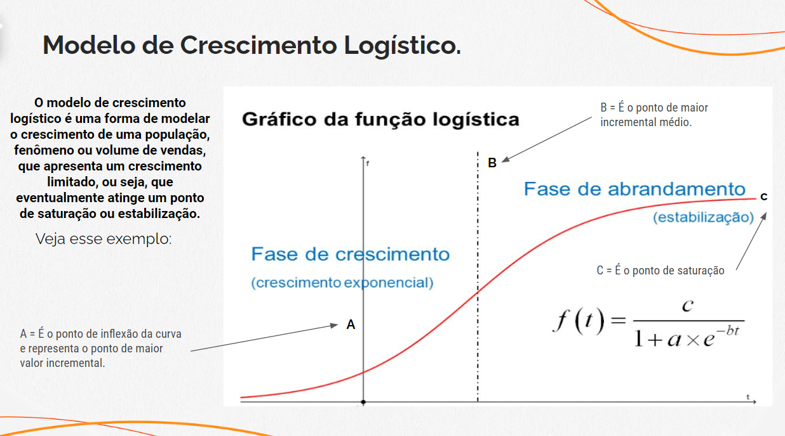
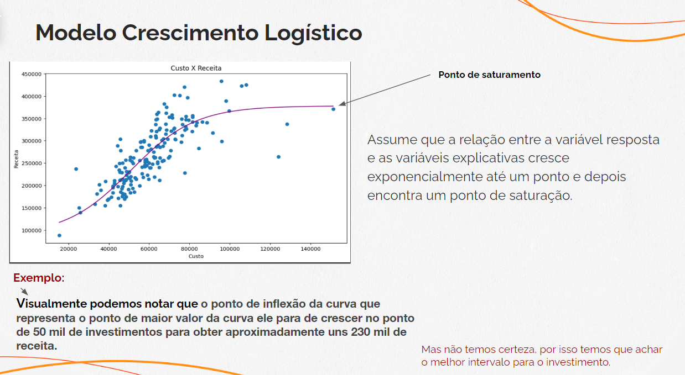
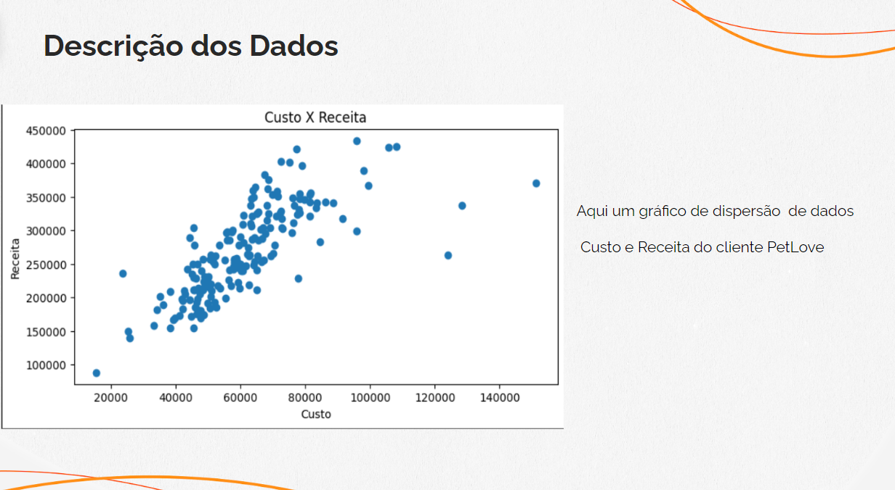
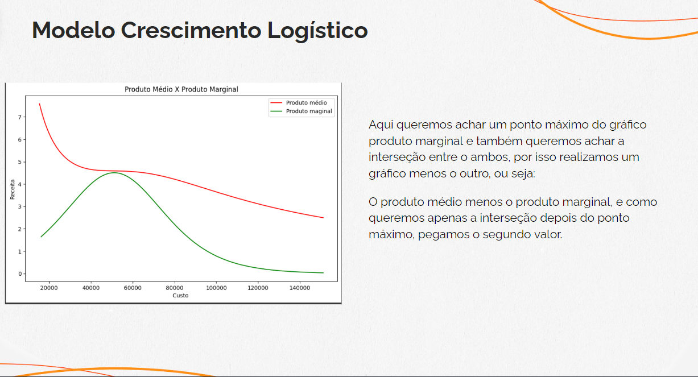
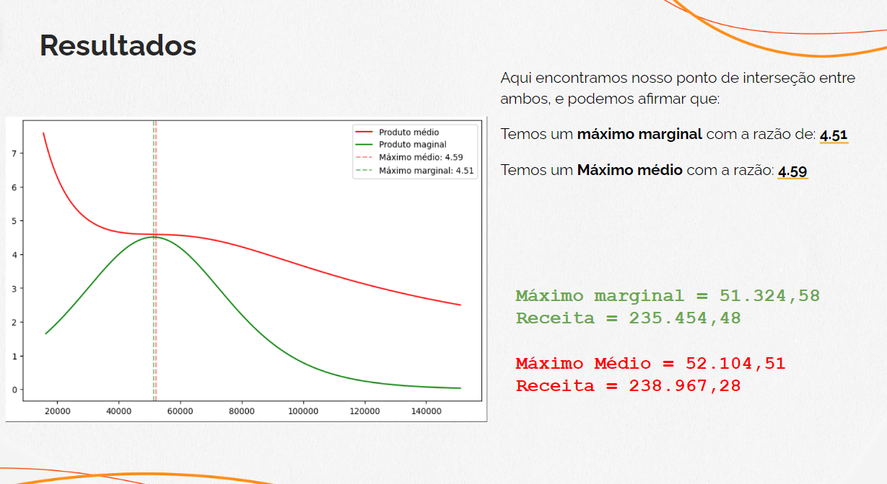
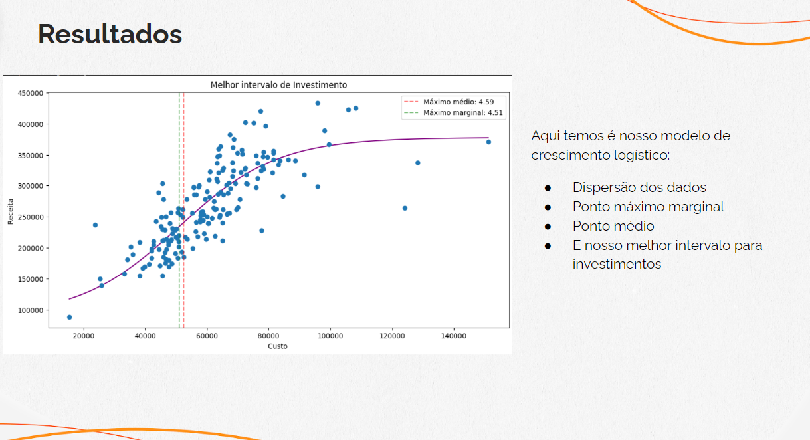
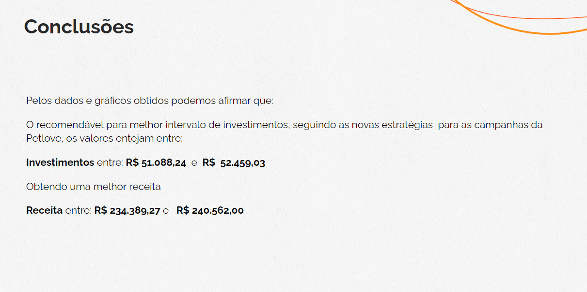

<!DOCTYPE html>
<html lang="pt-br">
    <meta charset="UTF-8">
    <meta name="viewport" content="width=device-width, initial-scale=1.0">
  <head>
    <title>Análise de Elasticidade</title>
    <meta name="viewport" content="width=device-width, initial-scale=1.0">
    
  </head>
  <body>
    <h1>Análise de Elasticidade</h1>
    <h3>Sugerindo um melhor intervalo de investimento saudável para as campanhas da Petlove, usando o modelo de crescimento logistico.</h3>
    

    

      
    
    
    
    
    
    
    

  </body>
</html>
